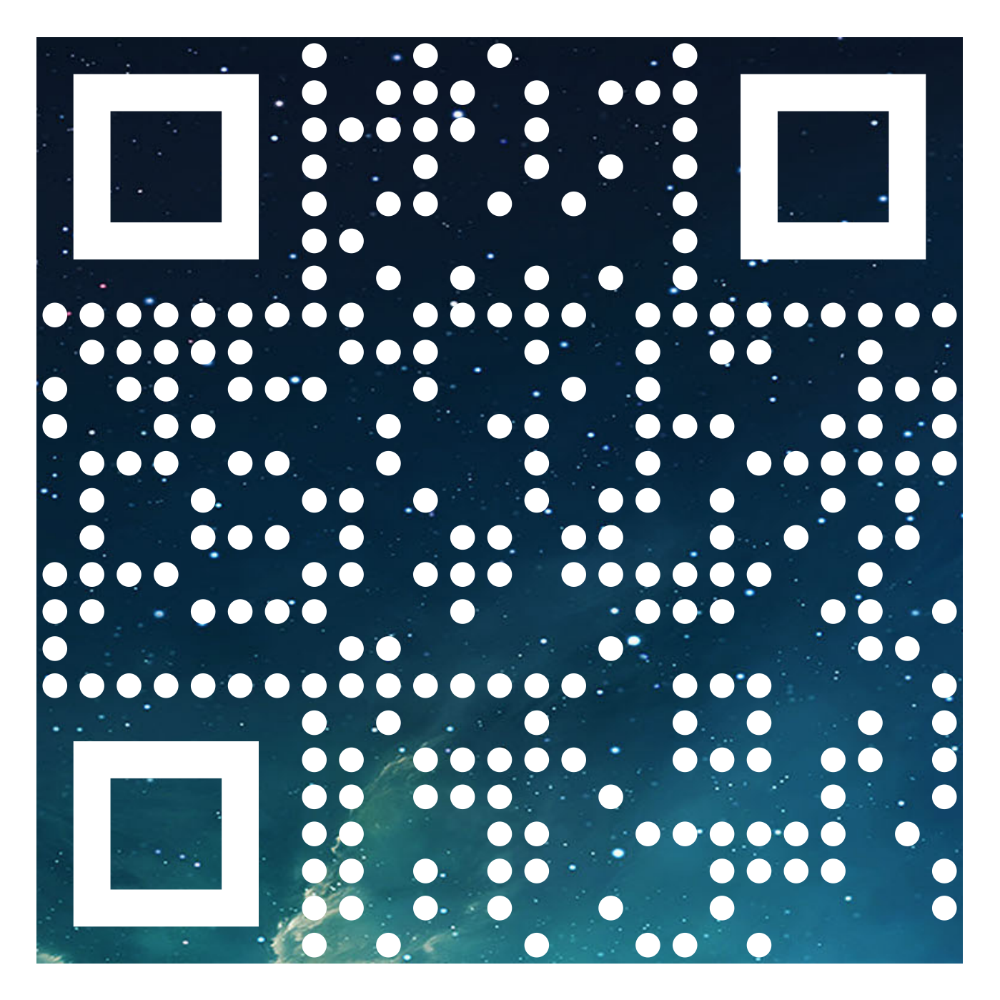
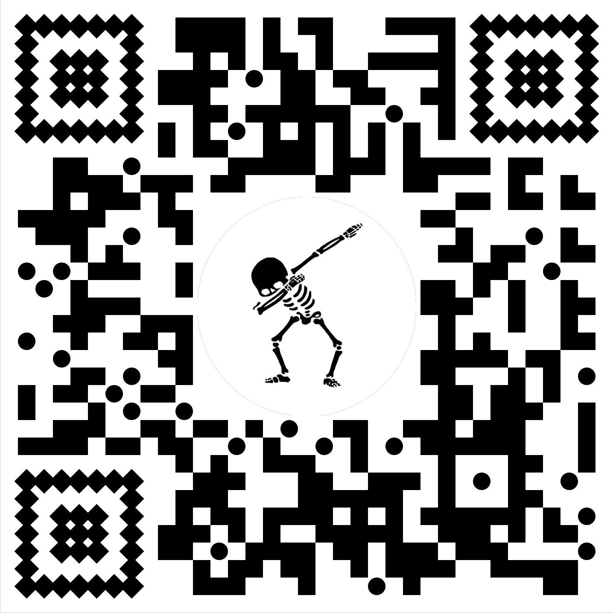

<p align="center">
  
  
  
</p>

<p align="center">
  Customisable QR Codes for React Native.
</p>

<!---
<p align="center">
  <a href="http://standardjs.com/"></a>
  <a href="https://npmjs.org/package/react-native-swiper"></a>
  <a href="https://npmjs.org/package/react-native-swiper"></a>
  <a href="https://github.com/leecade/react-native-swiper/pulls?q=is%3Apr+is%3Aclosed"></a>
  <a href="https://github.com/leecade/react-native-swiper/issues?q=is%3Aissue+is%3Aclosed"></a>
  <a href="https://gitter.im/leecade/react-native-swiper?utm_source=badge&utm_medium=badge&utm_campaign=pr-badge&utm_content=badge"></a>
</p>
--->

# react-native-custom-qr-codes (Under Development)

### TODO:
- [x] Implement QR Code generation algorithm
- [x] Create component
- [x] Implement properties for the component
- [x] Create first few standard designs
- [x] Test every potential usage
- [x] Create design file standard
- [x] Document usage
- [ ] Pimp out README.md
- [ ] Create Project Files
- [ ] Add tests for the package
- [ ] Write code contribution guide
- [ ] Write up design contribution guide
- [ ] Upload the package to npm

## Installation

.

## Usage


```jsx
import QRCode from 'react-native-custom-qr-codes';

<QRCode content='https://reactnative.com'/>
```

### Properties

| Prop | Description | Default |
|---|---|---|
|**`content`**|The String to be encoded in the QR code. |`'No Content'`|
|**`codeStyle`**|The style of the centre QR Code pieces. |`square`|
|**`outerEyeStyle`**|The style of the outside of the QR Code's eyes. |`square`|
|**`innerEyeStyle`**|The style of the inside of the QR Code's eyes. |`square`|
|**`size`**|The width & height of the component. |`250`|
|**`color`**|The color of the QR Code. |`black`|
|**`backgroundColor`**|The background color of the component. |`white`|
|**`padding`**|The padding between the edge of the component and the QR Code itself (In terms of QR code piece sizes). |`1`|
|**`logo`**|The image to be put in the centre of the QR Code.<br>**Must use a higher `ecl` for QR Code to work with a logo. <br>(L->M->Q->H)** |none|
|**`logoSize`**|The size of the logo in the QR Code. |none|
|**`linearGradient`**|The two colors to be used for the linear gradient for the foreground. |none|
|**`gradientDirection`**|The numbers that [define the orientation of the linear gradient](https://developer.mozilla.org/en-US/docs/Web/SVG/Tutorial/Gradients). |`[0,0,170,0]`|
|**`backgroundImage`**|The image to be used as the filling of the QR Code pieces.<br>**The Eyes can not be styled if a background image is used.**|none|
|**`ecl`**|The [error correction level](http://www.qrcode.com/en/about/error_correction.html) of the QR Code. |`L`|

## Examples

.

## Contributing

.

### Inspirations

QR Code generation: [papnkukn](https://github.com/papnkukn/qrcode-svg) (who got altered [davidshimjs](https://github.com/davidshimjs/qrcodejs)' original code)  
QR data styling algorithim: [mpaolino](https://github.com/mpaolino/qrlib)  
QR Code Designs: [QR Code Monkey](https://www.qrcode-monkey.com/)
