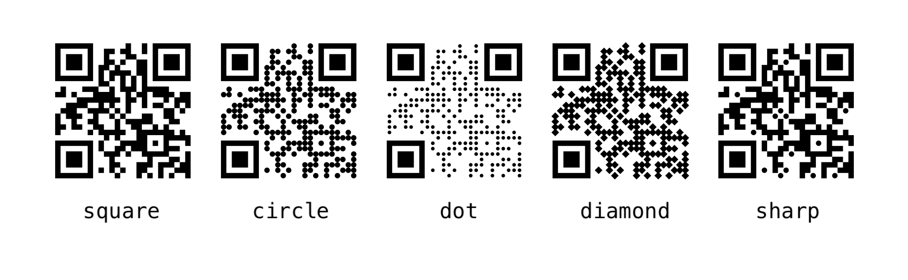
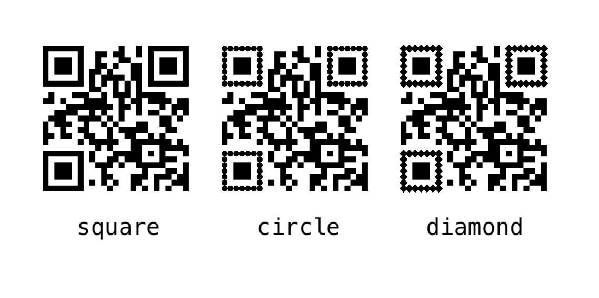
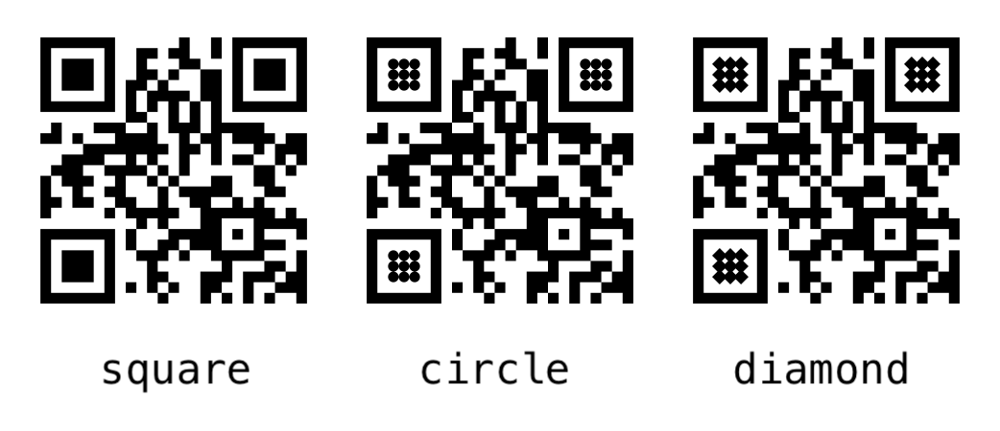
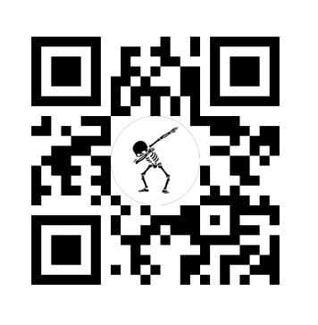
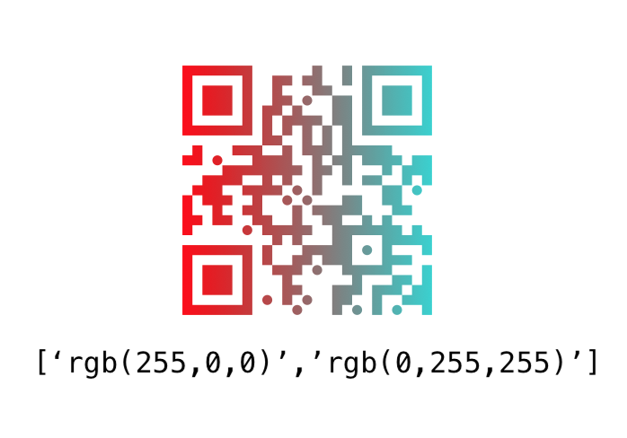

# react-native-custom-qr-codes

<p align="center">
  
  
  
</p>
	
<p align="center">
</p>

<p align="center">
  Customisable QR Codes for React Native.
</p>

## Installation

`npm install react-native-custom-qr-codes`

If you are not using Expo, you will also have to manually link the [react-native-svg library](https://github.com/react-native-community/react-native-svg).  
Follow [the instructions here](https://github.com/react-native-community/react-native-svg#manual) to do this.

## Usage


```jsx
import { QRCode } from 'react-native-custom-qr-codes';

<QRCode content='https://reactnative.com'/>
```

### Properties

| Prop | Description | Default |
|---|---|---|
|**`content`**|The String to be encoded in the QR code. |`'No Content'`|
|**`codeStyle`**|The style of the centre QR Code pieces. |`square`|
|**`outerEyeStyle`**|The style of the outside of the QR Code's eyes. |`square`|
|**`innerEyeStyle`**|The style of the inside of the QR Code's eyes. |`square`|
|**`size`**|The width & height of the component. |`250`|
|**`color`**|The color of the QR Code. |`black`|
|**`backgroundColor`**|The background color of the component. |`white`|
|**`padding`**|The padding between the edge of the component and the QR Code itself (In terms of QR code piece sizes). |`1`|
|**`logo`**|The image to be put in the centre of the QR Code.<br>**Must use a higher `ecl` for QR Code to work with a logo. <br>(L->M->Q->H)** |none|
|**`logoSize`**|The size of the logo in the QR Code. |none|
|**`linearGradient`**|The two colors to be used for the linear gradient for the foreground. |none|
|**`gradientDirection`**|The numbers that [define the orientation of the linear gradient](https://developer.mozilla.org/en-US/docs/Web/SVG/Tutorial/Gradients). |`[0,0,170,0]`|
|**`backgroundImage`**|The image to be used as the filling of the QR Code pieces.<br>**The Eyes can not be styled if a background image is used.**|none|
|**`ecl`**|The [error correction level](http://www.qrcode.com/en/about/error_correction.html) of the QR Code. |`L`|

## Examples

### `codeStyle`
```jsx
<QRCode codeStyle='square' />
<QRCode codeStyle='circle' />
<QRCode codeStyle='dot' />
<QRCode codeStyle='diamond' />
<QRCode codeStyle='sharp' />
```


### `outerEyeStyle`
```jsx
<QRCode outerEyeStyle='square' />
<QRCode outerEyeStyle='circle' />
<QRCode outerEyeStyle='diamond' />
```


### `innerEyeStyle`
```jsx
<QRCode innerEyeStyle='square' />
<QRCode innerEyeStyle='circle' />
<QRCode innerEyeStyle='diamond' />
```


### logo
```jsx
<QRCode logo={require('./dab.png')} />
```


### linearGradient
```jsx
<QRCode linearGradient={['rgb(255,0,0)','rgb(0,255,255)']} />
<QRCode linearGradient={['rgb(255,0,0)','rgb(0,255,255)']} gradientDirection={[0,170,0,0]} />
```


### backgroundImage
```jsx
<QRCode backgroundImage={require('./galaxy.png')} />
```


## Contributing

Take a look at [CONTRIBUTING.md](./CONTRIBUTING.md) 😁

## License

[MIT License](http://opensource.org/licenses/mit-license.html). © Geoffrey Natin 2017
